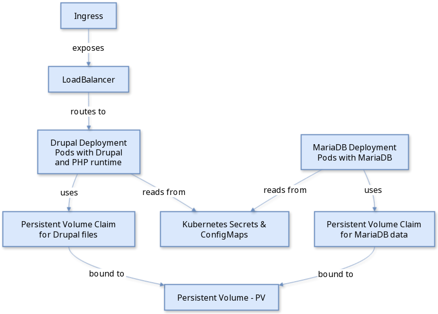

#+title: Lab1
#+PROPERTY: header-args :results pp
#+STARTUP: inlineimages

Welcome to Lab1 of *Leveraging Kubernetes for Drupal: A Beginner's Laboratory*

The goal is to set up a fully functional Drupal site using a Kubernetes cluster on your computer. Ideally using Linux.
With a local Kubernetes cluster you will be able to test and develop, mimicking a production cluster.

This guide assumes you have Docker installed on your Linux system.
If not, please install it first from https://docs.docker.com/engine/install/ or using your distribution packages.
Each major action is broken down into steps, with each step containing the necessary commands and explanations.

* Install kubectl and setup a Drupal Site on a Kubernetes Cluster

  This guide will walk you through the process of setting up a k3d Kubernetes cluster on Linux and deploying a Drupal site on it.

** Step 0: Installing kubectl
   :PROPERTIES:
   :CUSTOM_ID: install-kubectl
   :END:
   1. Download and install the latest version of kubectl.
      #+BEGIN_SRC bash
      curl -LO "https://dl.k8s.io/release/$(curl -L -s https://dl.k8s.io/release/stable.txt)/bin/linux/amd64/kubectl" && chmod +x ./kubectl && sudo mv ./kubectl /usr/local/bin/kubectl
      kubectl version --client
      #+END_SRC

** Step 1: Install k3d
   :PROPERTIES:
   :CUSTOM_ID: install-k3d
   :END:

   There are several tools that facilitate creating a local Kubernetes cluster, like k3d, kind or minikube.
   In Lab 1 we use k3d, while in Lab 2, we go over the other two.

   1. Download and install the latest version of k3d.
      #+BEGIN_SRC bash
      wget -q -O - https://raw.githubusercontent.com/rancher/k3d/main/install.sh | bash
      #+END_SRC
   2. Verify the installation.
      #+BEGIN_SRC shell
      k3d version
      #+END_SRC

      #+RESULTS:
      :results:
      k3d version v5.7.4
      k3s version v1.30.4-k3s1 (default)
      :end:

** Step 2: Create a k3d Cluster
   :PROPERTIES:
   :CUSTOM_ID: create-cluster
   :END:

   1. Create a multi-node Kubernetes cluster named =drupal-cluster= for development and testing.
      #+BEGIN_SRC bash
      k3d cluster create drupal-cluster --servers 1 --agents 2 -p "80:80@loadbalancer" -p "443:443@loadbalancer"
      #+END_SRC
   2. Configure kubectl to use the new cluster.
      #+BEGIN_SRC bash
      kubectl config use-context k3d-drupal-cluster
      #+END_SRC
   3. Verify the cluster status.
      #+BEGIN_SRC bash
      kubectl cluster-info
      #+END_SRC

** Step 3: Install Helm
   :PROPERTIES:
   :CUSTOM_ID: install-helm
   :END:
   1. Download and install Helm.
      #+BEGIN_SRC bash
      curl https://raw.githubusercontent.com/helm/helm/master/scripts/get-helm-3 | bash
      #+END_SRC
   2. Verify Helm installation.
      #+BEGIN_SRC bash
      helm version
      #+END_SRC

      #+RESULTS:
      :results:
      version.BuildInfo{Version:"v3.16.1", GitCommit:"5a5449dc42be07001fd5771d56429132984ab3ab", GitTreeState:"clean", GoVersion:"go1.22.7"}
      :end:

** Step 4: Add Bitnami Helm Chart Repository
   :PROPERTIES:
   :CUSTOM_ID: add-bitnami-repo
   :END:

   For our installation we will use helm charts from an opensource repository.
   Helm charts are yaml files that declare/define what the application will need to run.

   1. Add the Bitnami repository.
      #+BEGIN_SRC bash
      helm repo add bitnami https://charts.bitnami.com/bitnami
      #+END_SRC

      #+RESULTS:
      :results:
      "bitnami" already exists with the same configuration, skipping
      :end:

   2. Update Helm repository.
      #+BEGIN_SRC bash
      helm repo update
      #+END_SRC

      #+RESULTS:
      :results:
      Hang tight while we grab the latest from your chart repositories...
      ...Successfully got an update from the "nfs-subdir-external-provisioner" chart repository
      ...Successfully got an update from the "longhorn" chart repository
      ...Successfully got an update from the "bitnami" chart repository
      Update Complete. ⎈Happy Helming!⎈
      :end:

      NOTE: repositories are cached locally at $HOME/.cache/helm/ and configs in $HOME/.config/helm/. Check 'helm env'

** Step 5: Install Drupal
   :PROPERTIES:
   :CUSTOM_ID: install-drupal
   :END:

   A minimal Drupal installation will need two pods and two persistent volume claims.

*** Deploy Drupal using helm charts

   We are deploying Drupal using the =values.yaml= provided.
   This works around a problem which I provided a fix for in:
   https://github.com/bitnami/containers/pull/73235

   1. Deploy Drupal and MariaDB. This will use https://github.com/bitnami/charts/tree/main/bitnami/drupal
      #+BEGIN_SRC bash
      helm install my-drupal bitnami/drupal -f values.yaml
      #+END_SRC

   2. Monitor pod status.
      #+BEGIN_SRC bash
      kubectl get pods
      #+END_SRC

   4. List pods and deployments
      #+begin_src bash
      kubectl top pod --sort-by=cpu -A
      kubectl get deployments -A
      #+end_src

   5. List all Helms
      #+begin_src bash
      helm list -A
      #+end_src

   6. Where is my data stored?
      #+begin_src bash
      kubectl get pvc -A
      #+end_src

   7. What is going on?
      Follow the logs of your deployment:
      #+BEGIN_SRC bash
      kubectl logs -f deployment/my-drupal
      #+END_SRC

*** Deployment Diagram in mermaid

#+CAPTION: Deployment Diagram of Drupal into Kubernetes
#+NAME:   fig:1
#+ATTR_HTML: :align center with: 250px
#+ATTR_ORG:  :align left with: 250px

   #+begin_src mermaid :file diagram_mermaid.png :exports results
   graph TD
      Ingress -->|exposes| LoadBalancer
      LoadBalancer -->|routes to| DrupalDeployment[Drupal Deployment  Pods with Drupal and PHP runtime ]
      DrupalDeployment -->|uses| PVCDrupal[Persistent Volume Claim  for Drupal files ]
      PVCDrupal -->|bound to| PV[Persistent Volume - PV ]
      DrupalDeployment -->|reads from| SecretsConfigMaps[Kubernetes Secrets & ConfigMaps]

      MariaDBDeployment[MariaDB Deployment  Pods with MariaDB] -->|uses| PVCMariaDB[Persistent Volume Claim  for MariaDB data ]
      PVCMariaDB -->|bound to| PV
      MariaDBDeployment -->|reads from| SecretsConfigMaps

      classDef k8s fill:#f9f,stroke:#333,stroke-width:2px;
      class Ingress,LoadBalancer,DrupalDeployment,MariaDBDeployment,PVCDrupal,PVCMariaDB,PV,SecretsConfigMaps k8s;
   #+end_src

** Step 6: Access Your Drupal Site
   :PROPERTIES:
   :CUSTOM_ID: access-drupal
   :END:

   1. Get your Drupal login credentials by running:
      #+BEGIN_SRC bash
      echo Username: user
      echo Password: $(kubectl get secret --namespace default my-drupal -o jsonpath="{.data.drupal-password}" | base64 -d)
      #+END_SRC

2. Expose a port to connect to the Drupal deployment
Only use one of the options below

- OPTION 1: Use an ingress
	#+begin_src bash
	#kubectl create service clusterip drupal-ip --tcp=80:80
	kubectl create ingress my-drupal --rule="/*=my-drupal:80"
	#+end_src

	- OPTION 2: Forward port 80 to the my-drupal service

	Identify the Drupal service name:
	#+begin_src bash
	kubectl get services
	#+end_src
	You should see a service named my-drupal.
	Forward port 80 on your local machine to the service's port:
	#+begin_src bash
	kubectl port-forward svc/my-drupal 80:80
	#+end_src

- OPTION 3: If that didn't work, alternately you can forward port 80 to the Drupal pod.
#+BEGIN_SRC bash
DPOD=$(kubectl get pods --namespace default -l "app.kubernetes.io/name=drupal" -o jsonpath="{.items[0].metadata.name}")
kubectl port-forward --namespace default --address 127.0.0.1 $DPOD 80:80
#+END_SRC

3. Access Drupal site at http://localhost.

** Step 7: Monitoring Drupal
:PROPERTIES:
:CUSTOM_ID: monitoring-drupal
:END:
1.  Deploy Metrics Server to gather CPU and memory usage (not needed in k3d):
    #+begin_src bash
    # kubectl apply -f https://github.com/kubernetes-sigs/metrics-server/releases/latest/download/components.yaml
    #+end_src
2.  View the resource utilization of the Drupal pods:
    #+begin_src bash
    kubectl top pod
    #+end_src

    #+RESULTS:
    : NAME                         CPU(cores)   MEMORY(bytes)
    : my-drupal-7cff875dd7-nkhmj   3m           119Mi
    : my-drupal-mariadb-0          32m          203Mi

3.  View Drupal logs:
    #+begin_src bash
    kubectl logs $(kubectl get pods -l app.kubernetes.io/name=drupal -o jsonpath='{.items[0].metadata.name}')
    #+end_src

** Step 8: Configure Drupal

Follow the on-screen instructions to complete the Drupal setup through your browser. You will need the database credentials, provided by Helm upon installation.

** Step 9: Test deleting the existing pods

1. In a new terminal run the command to watch the pod status

#+begin_src bash
watch "kubectl get pods; kubectl top pod"
#+end_src

2. Issue a delete of the drupal pod

#+begin_src bash
kubectl delete pods my-drupal-....
#+end_src

3. Observe that the pods gets reconstructed in a few seconds.

** Step 10: Scale up the deployment to three from Drupal pods

Issue the scale deployment command

#+begin_src bash
kubectl scale deployment my-drupal --replicas=3 -n default
#+end_src

Observe that Drupal is scaled up immediately

* Troubleshooting

** Ensure Pods are Running and Ready
   #+BEGIN_SRC bash
   kubectl get pods
   #+END_SRC

   #+RESULTS:
   :results:
   NAME                         READY   STATUS    RESTARTS   AGE
   my-drupal-84766b946f-m4pcd   1/1     Running   0          37m
   my-drupal-mariadb-0          1/1     Running   0          37m
   :end:

** Check Pod Logs for Errors
   #+BEGIN_SRC bash
   kubectl logs <pod-name>
   #+END_SRC

** I am not able to reistall my-drupal using helm

To fully clean your previous deployment and make sure it still runs
you need to run these commands:

   #+BEGIN_SRC bash
   helm uninstall my-drupal;
   kubectl delete pvc data-my-drupal-mariadb-0 my-drupal-drupal
   kubectl get pvc -A
   #+END_SRC

If the volumes are not deleted the connection to the database will not work.

** Read the image instructions

https://github.com/bitnami/containers/tree/main/bitnami/drupal

** Install my-drupal with image.debug=true

helm install my-drupal bitnami/drupal --set image.debug=true

** Describe the pod or the deployment to get status and events
   - For pod by name:
     #+BEGIN_SRC bash
     kubectl describe pod <pod-name> -n <namespace>
     #+END_SRC
   - For pod by labels:
     #+BEGIN_SRC bash
     kubectl describe pods -l app.kubernetes.io/name=drupal
     #+END_SRC
   - For deployment:
     #+BEGIN_SRC bash
     kubectl describe deployment <deployment-name> -n <namespace>
     #+END_SRC

** Get events for the all namespace

     #+BEGIN_SRC bash
     kubectl get events -n default
     #+END_SRC

** Verify if Web Server is Running Inside the Pod
   - For Apache:
     #+BEGIN_SRC bash
     kubectl exec <pod-name> -- pgrep httpd
     #+END_SRC
   - For Nginx:
     #+BEGIN_SRC bash
     kubectl exec <pod-name> -- pgrep nginx
     #+END_SRC

** Restart the Pod if Necessary
   - Deleting the pod will recreate it
     #+BEGIN_SRC bash
     kubectl delete pod <pod-name>
     #+END_SRC

** Check Kubernetes Service and Deployment Configurations
   - Services:
     #+BEGIN_SRC bash
     kubectl get svc
     #+END_SRC
   - Deployment Configurations:
     #+BEGIN_SRC bash :results pp
     kubectl get deployment my-drupal -o yaml
     #+END_SRC

** Use a debug container

   - Spin up a debug beside the failing pod
     #+begin_src bash
     kubectl debug <pod> -it --image=ubuntu
     #+end_src

** Bonus 1: Expose Drupal through a NodePort or LoadBalancer Service for Easier Access
   - NodePort Service:
     #+BEGIN_SRC bash
     kubectl expose deployment <deployment-name> --type=NodePort --name=drupal-service --port=80
     #+END_SRC
   - LoadBalancer Service:
     #+BEGIN_SRC bash
     kubectl expose deployment <deployment-name> --type=LoadBalancer --name=drupal-loadbalancer --port=80
     #+END_SRC

* Cleanup

** Delete the k3d Cluster and images
   :PROPERTIES:
   :CUSTOM_ID: delete-cluster
   :END:
   1. Delete the Kubernetes cluster.
      #+BEGIN_SRC bash
      kind delete cluster

      k3d cluster delete drupal-cluster
      #+END_SRC
   2. Delete all K8s volumes or unused docker leftovers
      #+BEGIN_SRC bash
      helm delete my-drupal
      kubectl delete pvc --all
      docker system prune -f
      #+END_SRC

** Quick recreate

#+BEGIN_SRC bash
k3d cluster delete drupal-cluster;
k3d cluster create drupal-cluster --servers 1 --agents 2 -p "80:80@loadbalancer" -p "443:443@loadbalancer";
kubectl create namespace drupal;
helm install my-drupal bitnami/drupal -f values.yaml -n drupal;
ingress.networking.k8s.io/my-drupal created
#+END_SRC

Congratulations, you have now deployed a Drupal site on a k3d Kubernetes cluster on Linux!
